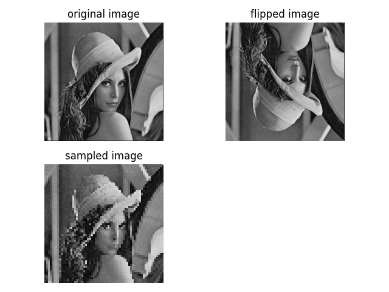
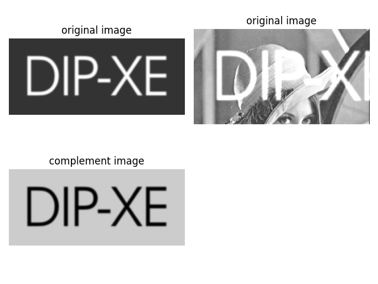

# Image Processing Examples

This is a simple Python script using OpenCV and Matplotlib to demonstrate various image processing operations.

## Requirements

- Python 3.x
- OpenCV
- Matplotlib

## Installation

Install the required Python packages using the following command:

```bash
pip install opencv-python matplotlib
```

## Usage

1. Clone the repository:

```bash
git clone git@github.com:0nur0duncu/image-processing-cv.git
cd extras/IMGCOMPLEMENT
```

2. Run the script:

```bash
python img_complement.py
```

3. View the results:

The script will display two sets of subplots, each showing different image processing operations:

### Set 1: Operations on the First Image (I1)

- Subplot 1: Original image.
- Subplot 2: Flipped image (reversed along the vertical axis).
- Subplot 3: Sampled image (selecting every 4th row and column).

### Set 2: Operations on the Second Image (I2)

- Subplot 1: Original image.
- Subplot 2: Combined image (addition of a portion of I1 to I2).
- Subplot 3: Complement image (inverse of the colors).

## Example




```

```
