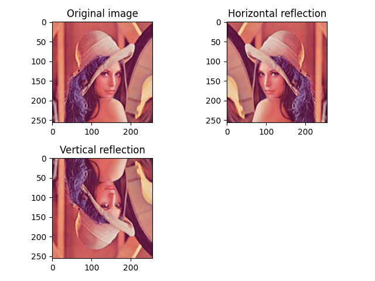

Aşağıda, bu Python kodu için bir README.md dosyası örneği bulabilirsiniz:

# Image Reflection Example

This is a simple Python script using OpenCV and Matplotlib to demonstrate image reflection in both horizontal and vertical directions.

## Requirements

- Python 3.x
- OpenCV
- Matplotlib
- NumPy

## Installation

Install the required Python packages using the following command:

```bash
pip install opencv-python matplotlib numpy
```

## Usage

1. Clone the repository:

```bash
git clone git@github.com:0nur0duncu/image-processing-cv.git
cd extras/IMGROTATEAXIAL
```

2. Run the script:

```bash
python img_rotate_axial.py
```

3. View the results:

The script will display a 2x2 grid of subplots, each showing a different reflection of the original image:

- Subplot 1: Original image.
- Subplot 2: Image horizontally reflected.
- Subplot 3: Image vertically reflected.

## Example


