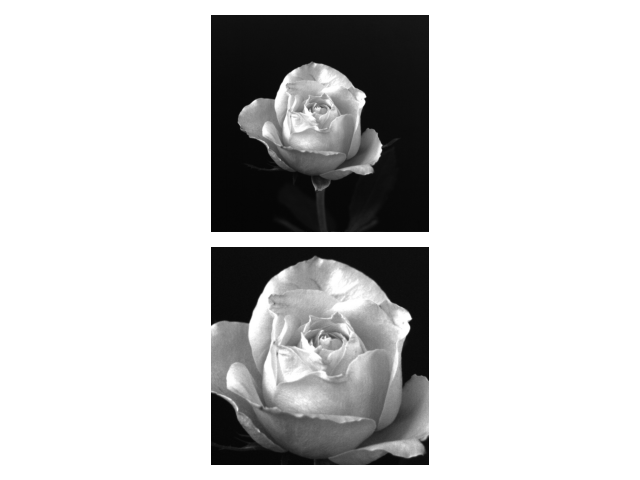

# Image Cropping and Resizing Example

This is a simple Python script using OpenCV and Matplotlib to demonstrate image cropping and resizing.

## Requirements

- Python 3.x
- OpenCV
- Matplotlib

## Installation

Install the required Python packages using the following command:

```bash
pip install opencv-python matplotlib
```

## Usage

1. Clone the repository:

```bash
git clone git@github.com:0nur0duncu/image-processing-cv.git
cd extras/IMGZOOM
```

2. Run the script:

```bash
python img_zoom.py
```

3. View the results:

The script will display a Matplotlib subplot with the following sections:

- Subplot 1: Original image and a cropped region.
- Subplot 2: Enlarged (2x) version of the original image.
- Subplot 3: Shrunk (0.5x) version of the original image.

## Example


