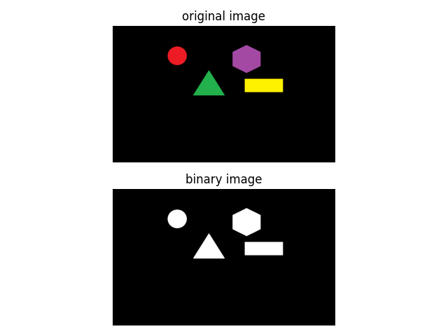

# Binary Image Conversion Example

This is a Python script using OpenCV and Matplotlib to demonstrate the conversion of an image to a binary format based on a specific condition.

## Requirements

- Python 3.x
- OpenCV
- Matplotlib
- NumPy

## Installation

Install the required Python packages using the following command:

```bash
pip install opencv-python matplotlib numpy
```

## Usage

1. Clone the repository:

```bash
git clone git@github.com:0nur0duncu/image-processing-cv.git
cd extras/RGB2BINARY
```

2. Run the script:

```bash
python binary_image_conversion.py
```

3. View the results:

The script will display a Matplotlib subplot with two images:

- Subplot 1: Original image.
- Subplot 2: Binary image obtained by converting pixels based on a specific condition.

## Example


