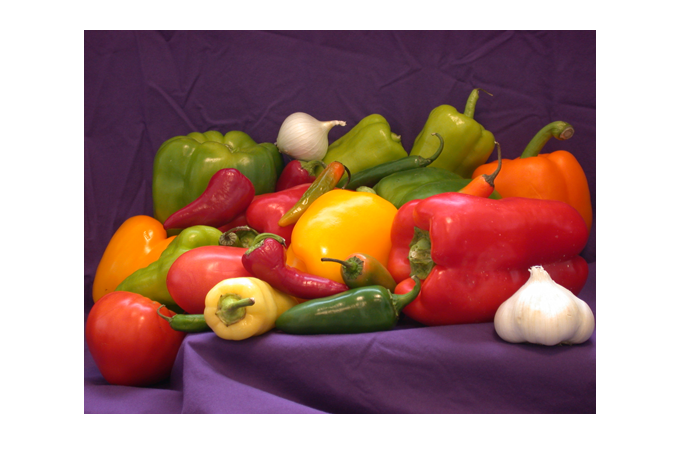
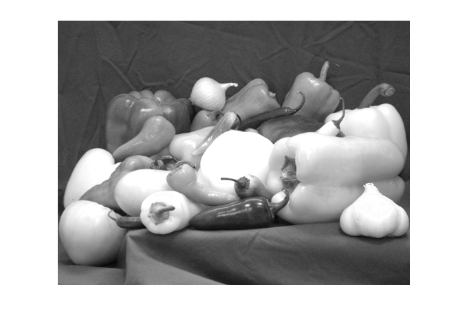
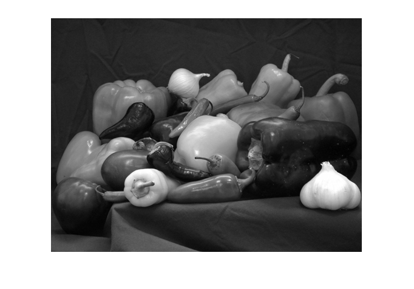
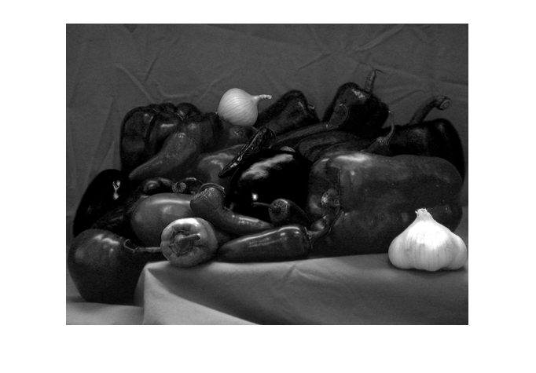
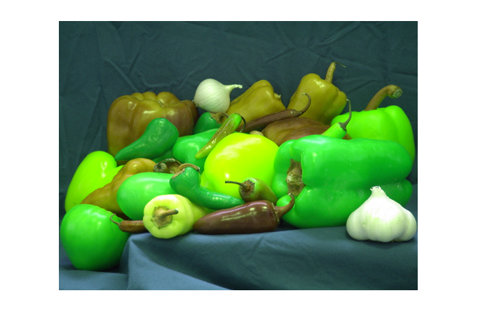
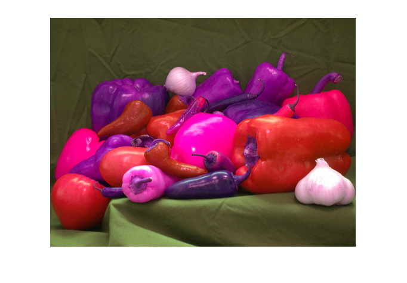
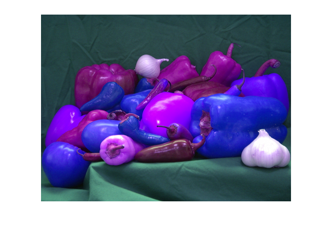
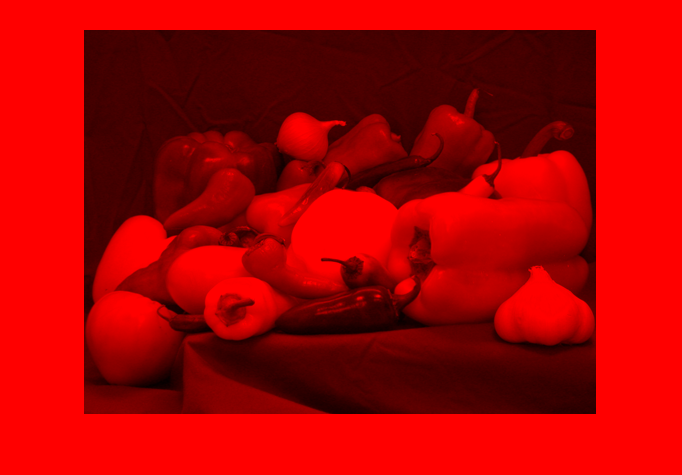
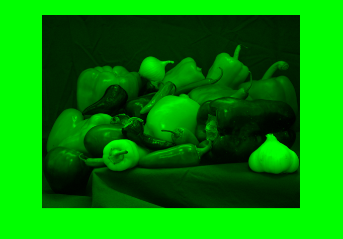
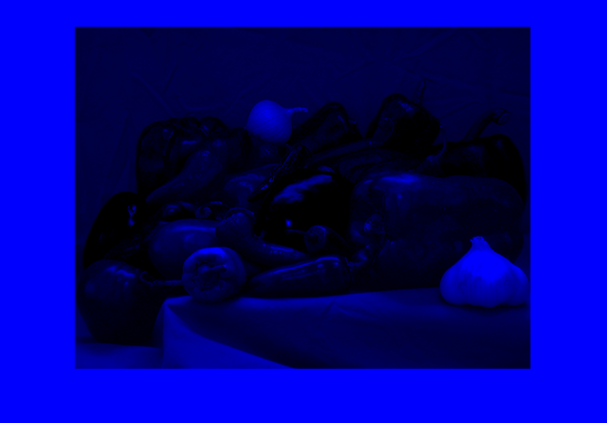

# Image Processing with OpenCV and Matplotlib

This Python script demonstrates basic image processing using OpenCV and visualizing the results with Matplotlib. The script performs various operations, including converting an image to grayscale, manipulating color channels, and creating artificial color representations.

## Natural Color and Grayscale Representation


_Figure 1: Natural Color_


_Figure 2: Grayscale representation of the Red Band_


_Figure 3: Grayscale representation of the Green Band_


_Figure 4: Grayscale representation of the Blue Band_

_Gray-scale, monochromatic representation is shown in Figures 2, 3, and 4._

## Artificial Color Representations

### RGB Color Order


_Figure 5: Original Image_


_Figure 6: GRB Color Order_


_Figure 7: RBG Color Order_


_Figure 8: GBR Color Order_

_Yapay renkli RGB görüntüler are shown in Figures 6, 7, and 8._

### Isolating Color Channels


_Figure 9: Original Image_


_Figure 10: Image with only the Red Channel_


_Figure 11: Image with only the Green Channel_


_Figure 12: Image with only the Blue Channel_

_(Kırmızı-yeşil-mavi) yapay renklendirilmesi is shown in Figures 10, 11, and 12._

## How to Run the Code

1. Clone the repository:

```bash
git clone git@github.com:0nur0duncu/image-processing-cv.git
```
