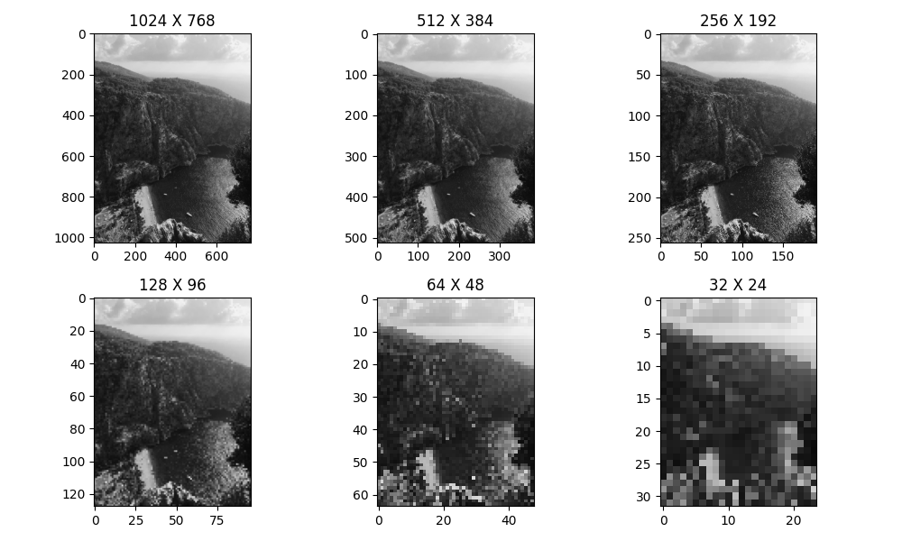

# Image Resolution Reduction Example

This Python script, created by Onur Oduncu, demonstrates the reduction of image resolution by decreasing its dimensions. The script reads an image file and resizes it to various dimensions, showing the impact on image resolution. The resulting images are displayed using Matplotlib.

## Usage

1. Clone the repository:

   ```bash
   git clone git@github.com:0nur0duncu/image-processing-cv.git
   cd Odev3_Python.py
   ```

2. Run the script:

   ```bash
   python image_resolution_reduction.py
   ```

3. View the results:

   The script will display a series of resized images with decreasing dimensions, illustrating the impact on image resolution.

## Example




