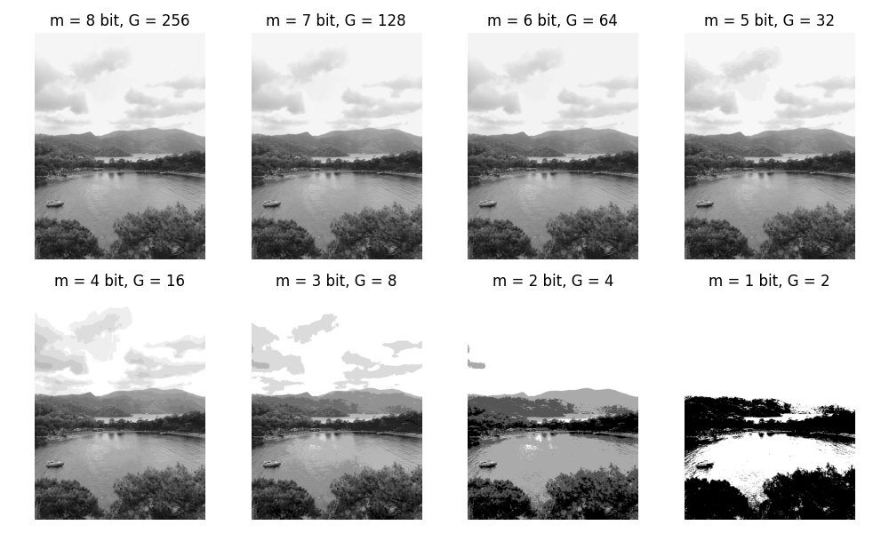

# Image Resolution Reduction Example

This Python script, created by Onur Oduncu, demonstrates the reduction of image resolution by decreasing the bit depth. The script reads an image file, converts it to grayscale, and then reduces the bit depth progressively. The resulting images are displayed using Matplotlib.

## Usage

1. Clone the repository:

   ```bash
   git clone git@github.com:0nur0duncu/image-processing-cv.git
   cd Odev4_Python.py
   ```

2. Run the script:

   ```bash
   python image_resolution_reduction.py
   ```

3. View the results:

   The script will display a series of grayscale images with decreasing bit depths, illustrating the impact on image resolution.

## Example


